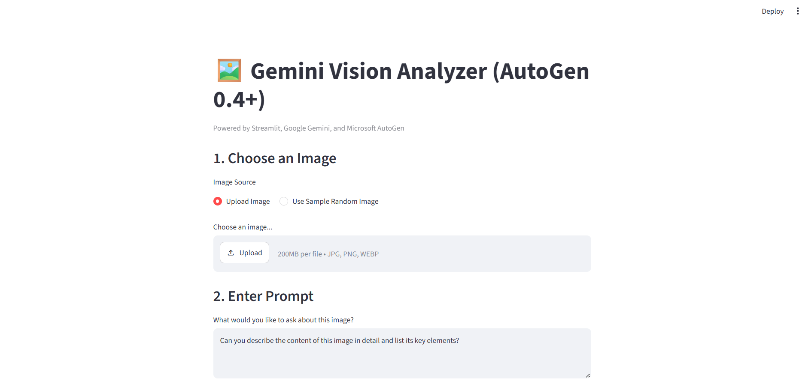
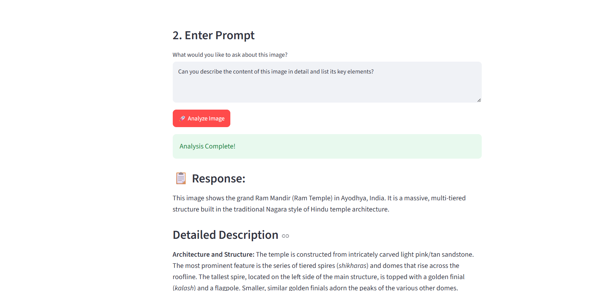
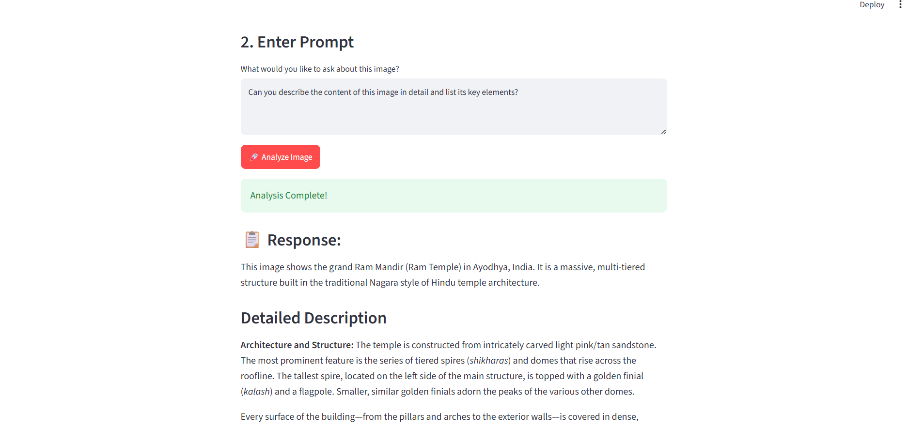

# 🖼️ Multimodal AI Image Analyzer using Microsoft AutoGen & Google Gemini

An interactive **Multimodal AI Image Analyzer** built using **Python, Microsoft AutoGen 0.4+, Google Gemini Vision, and Streamlit**.

The application allows users to upload an image or generate a random sample image, enter a natural-language prompt, and receive an AI-powered analysis of the image.

---

## 🚀 Project Overview

This project demonstrates how **Microsoft AutoGen** can be integrated with **Google Gemini's multimodal capabilities** to build an interactive image-understanding application.

The application accepts both **text and image input** and sends them to a Gemini multimodal model through AutoGen.

### What the application can do

* 🖼️ Upload images
* 🌐 Fetch random sample images
* 👀 Preview selected images
* 💬 Accept custom natural-language prompts
* 🤖 Analyze images using Google Gemini
* 🔗 Use Microsoft AutoGen for model communication
* 🖥️ Provide an interactive Streamlit interface
* 🔐 Load API credentials securely using environment variables

---

# ✨ Features

### 🖼️ Image Input

Users can select one of two image sources:

**1. Upload Image**

Supported formats:

```text
JPG
JPEG
PNG
WEBP
```

**2. Use Sample Random Image**

The application can fetch a random image from Picsum Photos for testing and demonstration.

---

### 🤖 Multimodal Image Analysis

The application sends:

```text
Image + User Prompt
```

to the Gemini multimodal model.

For example:

```text
Describe this image in detail and identify the important objects.
```

Gemini analyzes the visual content and generates a natural-language response.

---

### 💬 Custom Prompt Support

Users can ask different questions about the selected image.

Examples:

```text
Describe this image.
```

```text
Identify all important objects in this image.
```

```text
Explain what is happening in this image.
```

```text
Extract any visible text from this image.
```

```text
Describe the environment, objects, colors, and important details.
```

---

# 🏗️ System Architecture

```text
                 ┌─────────────────────┐
                 │        User         │
                 └──────────┬──────────┘
                            │
                            ▼
                 ┌─────────────────────┐
                 │     Streamlit UI    │
                 └──────────┬──────────┘
                            │
                    Image + Prompt
                            │
                            ▼
                 ┌─────────────────────┐
                 │   Microsoft AutoGen │
                 └──────────┬──────────┘
                            │
                            ▼
                 ┌─────────────────────┐
                 │ OpenAI Compatible   │
                 │    Model Client     │
                 └──────────┬──────────┘
                            │
                            ▼
                 ┌─────────────────────┐
                 │   Google Gemini     │
                 │  Multimodal Model   │
                 └──────────┬──────────┘
                            │
                            ▼
                 ┌─────────────────────┐
                 │   AI Analysis       │
                 └──────────┬──────────┘
                            │
                            ▼
                 ┌─────────────────────┐
                 │  Streamlit Result   │
                 └─────────────────────┘
```

---

# 🛠️ Technologies Used

| Technology            | Purpose                         |
| --------------------- | ------------------------------- |
| **Python**            | Application development         |
| **Streamlit**         | Interactive web interface       |
| **Microsoft AutoGen** | AI model communication          |
| **Google Gemini**     | Multimodal image analysis       |
| **Pillow (PIL)**      | Image processing                |
| **Requests**          | Fetching sample images          |
| **python-dotenv**     | Environment variable management |
| **asyncio**           | Asynchronous model execution    |

---

# 📂 Project Structure

```text
autogen-multi-agent-ai/
│
├── 📁 Images/
│   ├── 🖼️ Home.png
│   ├── 🖼️ Output1.png
│   ├── 🖼️ Output2.png
│   └── 🖼️ Output3.png
│
├── 📄 ag-multiagent.py
├── 📄 requirements.txt
├── 📄 .env.example
├── 📄 .gitignore
└── 📄 README.md
```

### 📁 Folder & File Description

| File / Folder      | Description                       |
| ------------------ | --------------------------------- |
| `Images/`          | Contains application screenshots  |
| `Home.png`         | Application home page screenshot  |
| `Output1.png`      | First image analysis result       |
| `Output2.png`      | Second image analysis result      |
| `Output3.png`      | Third image analysis result       |
| `ag-multiagent.py` | Main Streamlit application        |
| `requirements.txt` | Required Python packages          |
| `.env.example`     | Example environment configuration |
| `.gitignore`       | Files excluded from Git           |
| `README.md`        | Project documentation             |

---

## 📸 Application Screenshots

### 🏠 Home Page



### 📋 Output 1


### 📋 Output 2



### 📋 Output 3



# ⚙️ Installation

## 1. Clone the Repository

```bash
git clone https://github.com/YOUR_USERNAME/autogen-multi-agent-ai.git
```

Navigate to the project directory:

```bash
cd autogen-multi-agent-ai
```

---

## 2. Create a Virtual Environment

For Windows:

```powershell
python -m venv venv
```

Activate the virtual environment:

```powershell
.\venv\Scripts\activate
```

You should see:

```text
(venv)
```

in your terminal.

---

## 3. Install Required Packages

```powershell
python -m pip install -r requirements.txt
```

If you don't have a `requirements.txt` yet, install the dependencies with:

```powershell
python -m pip install streamlit python-dotenv pillow requests autogen-core autogen-agentchat "autogen-ext[openai]"
```

---

# 🔑 API Configuration

This project requires a **Google Gemini API key**.

Create a `.env` file in the project root:

```text
.env
```

Add:

```env
GEMINI_API_KEY=your_gemini_api_key_here
```

The application loads the key using:

```python
from dotenv import load_dotenv

load_dotenv()
```

and retrieves it using:

```python
gemini_key = os.getenv("GEMINI_API_KEY")
```

---

## ⚠️ Security

**Never upload your `.env` file to GitHub.**

Your `.gitignore` should contain:

```gitignore
venv/
.env
__pycache__/
*.pyc
.streamlit/secrets.toml
```

Instead, create `.env.example`:

```env
GEMINI_API_KEY=your_gemini_api_key_here
```

This allows other developers to understand which environment variable is required without exposing your secret API key.

---

# ▶️ Running the Application

After installing the dependencies and configuring your API key, run:

```powershell
python -m streamlit run ag-multiagent.py
```

Streamlit will start the application locally.

---

# 🔄 Application Workflow

### Step 1 — Select Image

Choose either:

```text
Upload Image
```

or:

```text
Use Sample Random Image
```

### Step 2 — Preview Image

The selected image is displayed in the Streamlit interface.

### Step 3 — Enter Prompt

Enter a question or instruction describing what you want Gemini to analyze.

### Step 4 — Analyze

Click:

```text
🚀 Analyze Image
```

### Step 5 — AutoGen Processing

AutoGen creates a multimodal message containing:

```text
User Prompt
+
Image
```

### Step 6 — Gemini Processing

The Gemini multimodal model analyzes the image and generates a response.

### Step 7 — Display Result

The generated analysis is displayed directly in the Streamlit application.

---

# 🧠 AutoGen Implementation

The project uses AutoGen's model client:

```python
from autogen_ext.models.openai import OpenAIChatCompletionClient
```

The Gemini model is configured through Google's OpenAI-compatible API endpoint.

The application creates the model client using:

```python
model_client = OpenAIChatCompletionClient(
    model="gemini-3-flash-preview",
    api_key=api_key,
    base_url="https://generativelanguage.googleapis.com/v1beta/openai/",
    model_info=gemini_model_info
)
```

The image is converted into an AutoGen image object:

```python
ag_img = AGImage(image)
```

The prompt and image are then passed together:

```python
user_msg = UserMessage(
    content=[prompt, ag_img],
    source="user"
)
```

The model generates the final response:

```python
response = await model_client.create([user_msg])
```

---

# 💡 Example Use Cases

This application can be extended for:

* 🖼️ Image description
* 🔍 Visual question answering
* 📄 Document understanding
* 🧾 Invoice analysis
* 📝 OCR and text extraction
* 🏞️ Scene understanding
* 🛍️ Product image analysis
* 🎓 Educational image analysis
* 🤖 Multimodal AI assistants

---

# 🎯 Learning Outcomes

Through this project, you can learn:

* Microsoft AutoGen fundamentals
* Multimodal Generative AI
* Gemini Vision models
* OpenAI-compatible APIs
* Image processing with Pillow
* Async Python programming
* Streamlit application development
* Environment variable management
* API integration
* Prompt engineering
* Multimodal AI workflows

---

# 🔮 Future Enhancements

Planned improvements could include:

* 🤖 Multiple specialized AutoGen agents
* 🔍 Object detection
* 📄 Advanced document analysis
* 🧾 Invoice and receipt processing
* 📝 OCR integration
* 💾 Analysis history
* 📥 Downloadable reports
* 🗣️ Voice-based image queries
* 📊 Image classification
* 🧠 Specialized vision agents
* 🔐 Improved authentication and security

---

# 👩‍💻 Author

## Ankita Shendge

**B.Tech — Artificial Intelligence & Data Science**

### Areas of Interest

* Artificial Intelligence
* Machine Learning
* Generative AI
* Agentic AI
* Data Science
* Multimodal AI

---

# ⭐ Project Highlights

```text
Microsoft AutoGen
        +
Google Gemini
        +
Multimodal AI
        +
Streamlit
        +
Python
```

A practical demonstration of building an interactive **AI-powered multimodal image analysis application** using modern Generative AI technologies.

---

# 📜 License

This project is intended for **educational and portfolio purposes**.

You are welcome to explore, modify, and extend the project for learning and experimentation.

