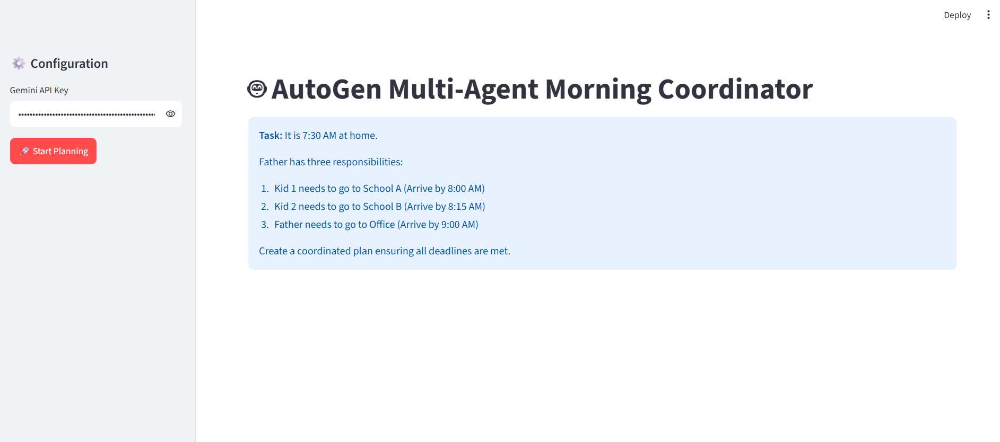
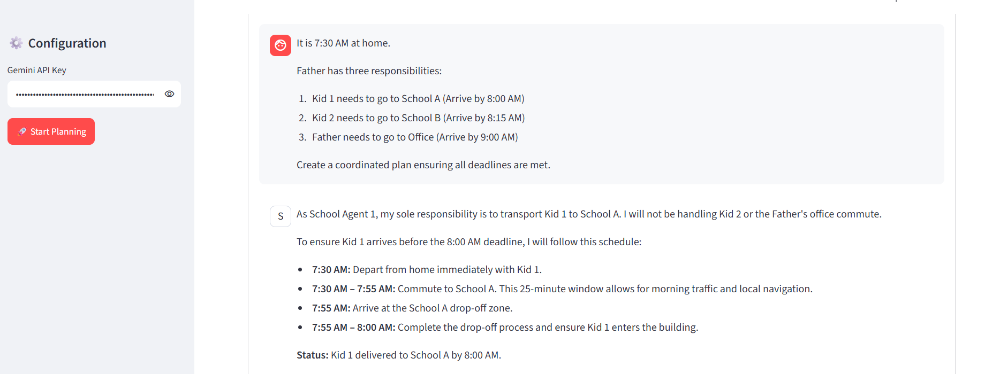
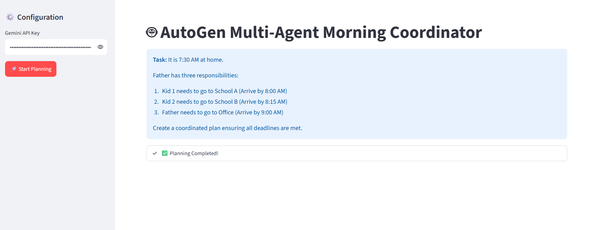

# 🤖 AutoGen AI Projects

A collection of practical **Agentic AI projects** built using **Microsoft AutoGen, Google Gemini, Python, and Streamlit**.

This repository contains multiple projects demonstrating **Single-Agent AI, Multi-Agent AI, Multimodal Vision AI, Gemini integration, and Multi-Agent planning**.

---

## 🚀 Projects

This repository includes:

1. 🌱 **AutoGen Single Agent**
2. 👥 **AutoGen Multi-Agent**
3. 🖼️ **AutoGen Vision Analyzer**
4. 🧠 **AutoGen Gemini**
5. 🌅 **AutoGen Morning Plan**

---

# 📂 Repository Structure

```text
autogen-ai-project/
│
├── 📁 Ag-morning-plan/
│   ├── ag-morning-plan.py
│   ├── requirements.txt
│   ├── .gitignore
│   ├── .env.example
│   ├── README.md
│   └── Images/
│       ├── Output1.png
│       ├── Output2.png
│       └── Output3.png
│
├── 📁 Autogen-Gemini/
│   ├── ag-gemini.py
│   ├── requirements.txt
│   └── README.md
│
├── 📁 Autogen-Multiagent/
│   ├── ag-multiagent.py
│   ├── requirements.txt
│   ├── .gitignore
│   ├── .env.example
│   ├── README.md
│   └── Images/
│       ├── Output1.png
│       ├── Output2.png
│       └── Output3.png
│
├── 📁 Autogen-Single/
│   ├── ag-single-agent.py
│   ├── requirements.txt
│   ├── .gitignore
│   ├── .env.example
│   ├── README.md
│   └── Images/
│       ├── Output1.png
│  
│     
│
├── 📁 Autogen-Vision/
│   ├── ag-vision.py
│   ├── requirements.txt
│   ├── .gitignore
│   ├── .env.example
│   ├── README.md
│   └── Images/
│       ├── Home.png
│       ├── Output1.png
│       └── Output2.png
│
└── README.md
```

---

# 1. 🌱 AutoGen Single Agent

## 📌 Overview

The **AutoGen Single Agent** project demonstrates how a single AI agent can act as a friendly mentor for explaining technical concepts to non-technical users.

The agent is designed to:

- Explain technical concepts simply
- Avoid unnecessary jargon
- Use real-world analogies
- Provide easy-to-understand explanations
- Interact with the user through Streamlit

### 🤖 Agent

```text
NonTech_Mentor
```

The agent receives a user question and generates a simple explanation using Google Gemini.

### 💡 Example Question

```text
Can you explain how a database index works using a library analogy?
```

### 🔄 Workflow

```text
User
  │
  ▼
Streamlit Interface
  │
  ▼
NonTech_Mentor
  │
  ▼
Google Gemini
  │
  ▼
Simple Explanation
```

### 🛠️ Technologies

- Python
- Microsoft AutoGen
- AutoGen AgentChat
- Google Gemini
- Streamlit
- python-dotenv
- asyncio

## 📸 Output Screenshots

### Output 1

<p align="center">
  
</p>

### Output 2

<p align="center">
  
</p>

### Output 3

<p align="center">
  
</p>

---

# 2. 👥 AutoGen Multi-Agent

## 📌 Overview

The **AutoGen Multi-Agent** project demonstrates how multiple specialized AI agents can communicate and collaborate to solve a coordinated task.

The system contains multiple agents with different responsibilities.

### 👦 School Agent 1

Responsible for:

```text
Take Kid 1 to School A
Arrival Deadline: 8:00 AM
```

### 👧 School Agent 2

Responsible for:

```text
Take Kid 2 to School B
Arrival Deadline: 8:15 AM
```

### 👨 Office Agent

Responsible for:

```text
Take Father to Office
Arrival Deadline: 9:00 AM
```

The Office Agent reviews the plans created by the school agents and coordinates the final schedule.

### 🔄 Architecture

```text
                    User
                     │
                     ▼
              Streamlit Application
                     │
                     ▼
              AutoGen Team
                     │
          ┌──────────┼──────────┐
          │          │          │
          ▼          ▼          ▼
      School 1   School 2   Office Agent
          │          │          │
          ▼          ▼          ▼
        Kid 1      Kid 2      Father
          │          │          │
          └──────────┼──────────┘
                     │
                     ▼
              Coordinated Plan
```

### 🛠️ Technologies

- Python
- Microsoft AutoGen
- Google Gemini
- Streamlit
- AutoGen AgentChat
- Async Python
- python-dotenv

## 📸 Output Screenshots

### Output 1

<p align="center">
  
</p>

### Output 2

<p align="center">
  
</p>

### Output 3

<p align="center">
  
</p>

---

# 3. 🖼️ AutoGen Vision Analyzer

## 📌 Overview

The **AutoGen Vision Analyzer** is a multimodal AI application that allows users to upload an image and ask questions about its content.

The application combines:

```text
Streamlit
     +
Microsoft AutoGen
     +
Google Gemini Vision
```

### ✨ Features

- Upload an image
- Use a random sample image
- Preview the selected image
- Enter a custom prompt
- Analyze images using Gemini Vision
- Display AI-generated responses

### 🖼️ Supported Formats

```text
.jpg
.jpeg
.png
.webp
```

### 🔄 Workflow

```text
User
 │
 ▼
Upload / Select Image
 │
 ▼
Enter Prompt
 │
 ▼
AutoGen
 │
 ▼
Gemini Vision
 │
 ▼
Image Analysis
 │
 ▼
AI Response
```

### 🛠️ Technologies

- Python
- Streamlit
- Microsoft AutoGen
- Google Gemini
- Pillow
- Requests
- python-dotenv
- asyncio

## 📸 Output Screenshots

### Home

<p align="center">
  
</p>

### Output 1

<p align="center">
  
</p>

### Output 2

<p align="center">
  
</p>

---

# 4. 🧠 AutoGen Gemini

## 📌 Overview

The **AutoGen Gemini** project demonstrates a basic integration between **Microsoft AutoGen and Google Gemini**.

The application uses the AutoGen OpenAI-compatible model client to communicate with Google's Gemini API.

### 🔄 Workflow

```text
User
 │
 ▼
UserMessage
 │
 ▼
AutoGen Model Client
 │
 ▼
Google Gemini
 │
 ▼
AI Response
```

### 💡 Example

The application can ask:

```text
What is the AutoGen framework in Agentic AI?
```

Gemini generates an explanation of AutoGen, Agentic AI, multi-agent systems, and agent collaboration.

### 🛠️ Technologies

- Python
- Microsoft AutoGen
- AutoGen Core
- AutoGen Extensions
- Google Gemini
- python-dotenv
- asyncio

### ▶️ Run

```bash
python ag-gemini.py
```

---

# 5. 🌅 AutoGen Morning Plan

## 📌 Overview

The **AutoGen Morning Plan** project demonstrates how multiple AI agents can collaborate to create a coordinated daily schedule.

The scenario starts at:

```text
7:30 AM
```

The father has three responsibilities:

```text
Kid 1 → School A → Arrive by 8:00 AM

Kid 2 → School B → Arrive by 8:15 AM

Father → Office → Arrive by 9:00 AM
```

### 👥 Agents

#### School Agent 1

Plans the transportation of Kid 1 to School A.

#### School Agent 2

Plans the transportation of Kid 2 to School B.

#### Office Agent

Reviews both school plans and coordinates Father's trip to the office.

### 🔄 Workflow

```text
                 Morning Task
                      │
                      ▼
                AutoGen Team
                      │
        ┌─────────────┼─────────────┐
        ▼             ▼             ▼
 School Agent 1  School Agent 2  Office Agent
        │             │             │
        ▼             ▼             ▼
     Kid 1          Kid 2         Father
        │             │             │
        ▼             ▼             ▼
   School A       School B        Office
        │             │             │
        └─────────────┼─────────────┘
                      ▼
              Coordinated Plan
```

### 🛠️ Technologies

- Python
- Microsoft AutoGen
- Google Gemini
- Streamlit
- AssistantAgent
- RoundRobinGroupChat
- TextMentionTermination
- asyncio
- python-dotenv

## 📸 Output Screenshots

### Output 1

<p align="center">
  
</p>

### Output 2

<p align="center">
  
</p>

### Output 3

<p align="center">
  
</p>

---

# 🧰 Technologies Used

This repository demonstrates practical usage of:

- 🐍 Python
- 🤖 Microsoft AutoGen
- 🧠 Google Gemini
- 🎨 Streamlit
- 🔄 AsyncIO
- 👥 Multi-Agent Systems
- 🌱 Single-Agent Systems
- 🖼️ Multimodal AI
- 💬 Large Language Models
- 🔐 Environment Variables
- 🧩 AgentChat
- ⚙️ AutoGen Core
- 🔌 AutoGen Extensions

---

# 🔐 Environment Variables

The projects use a Gemini API key.

Create a `.env` file inside the relevant project folder.

```env
GEMINI_API_KEY=your_actual_gemini_api_key
```

For GitHub, use `.env.example`:

```env
GEMINI_API_KEY=your_gemini_api_key_here
```

### ⚠️ Important

Never upload your real `.env` file or API key to GitHub.

The `.gitignore` file is configured to prevent `.env` from being committed.

---

# 📦 Installation

Clone the repository:

```bash
git clone https://github.com/shendgeankita522-blip/autogen-ai-project.git
```

Move into the project:

```bash
cd autogen-ai-project
```

Create a virtual environment:

```bash
python -m venv venv
```

Activate the virtual environment on Windows:

```powershell
.\venv\Scripts\activate
```

---

# ▶️ Running the Projects

## 🌱 Single Agent

```powershell
cd Autogen-Single
python -m pip install -r requirements.txt
python -m streamlit run ag-single-agent.py
```

---

## 👥 Multi-Agent

```powershell
cd Autogen-Multiagent
python -m pip install -r requirements.txt
python -m streamlit run ag-multiagent.py
```

---

## 🖼️ Vision Analyzer

```powershell
cd Autogen-Vision
python -m pip install -r requirements.txt
python -m streamlit run ag-vision.py
```

---

## 🌅 Morning Plan

```powershell
cd Ag-morning-plan
python -m pip install -r requirements.txt
python -m streamlit run ag-morning-plan.py
```

---

## 🧠 Gemini Example

```powershell
cd Autogen-Gemini
python -m pip install -r requirements.txt
python ag-gemini.py
```

---

# 🧠 Agentic AI Concepts Demonstrated

## 1. Single-Agent Architecture

```text
User
 │
 ▼
AI Agent
 │
 ▼
LLM
 │
 ▼
Response
```

## 2. Multi-Agent Architecture

```text
             User
              │
              ▼
        Agent Coordinator
         /      |       \
        ▼       ▼        ▼
    Agent 1  Agent 2  Agent 3
        \       |       /
         \      |      /
          ▼     ▼     ▼
           Final Result
```

## 3. Multimodal AI

```text
Text + Image
     │
     ▼
Gemini Vision
     │
     ▼
AI Analysis
```

## 4. Agent Collaboration

Agents can have different responsibilities and communicate with one another to solve a larger task.

---

# 🎯 Learning Objectives

These projects demonstrate practical understanding of:

- Agentic AI
- Generative AI
- Large Language Models
- AI Agents
- Multi-Agent Systems
- Single-Agent Systems
- Multimodal AI
- Microsoft AutoGen
- Google Gemini
- Prompt Engineering
- Agent Collaboration
- Task Delegation
- AI Planning
- Async Programming
- API Integration
- Streamlit Application Development
- Environment Variable Management

---

# 🌍 Possible Real-World Applications

The same architecture can be extended to:

### 🏢 Business Automation

- HR Agent
- Finance Agent
- Sales Agent
- Manager Agent

### 💻 Software Development

- Requirement Agent
- Developer Agent
- Testing Agent
- Code Review Agent

### 📊 Data Analysis

- Data Collection Agent
- Data Cleaning Agent
- Analysis Agent
- Reporting Agent

### 🎓 Education

- Teacher Agent
- Research Agent
- Quiz Agent
- Evaluation Agent

### ✈️ Travel Planning

- Travel Agent
- Hotel Agent
- Transport Agent
- Activity Agent

---

# 🔮 Future Enhancements

Planned improvements can include:

- 🧠 Agent memory
- 💾 Persistent conversations
- 🌐 Web search tools
- 🔧 Custom tools
- 📚 RAG integration
- 👤 Human-in-the-loop
- 📅 Calendar integration
- 🗺️ Maps integration
- 🎙️ Voice interaction
- 📊 Agent monitoring
- 🔐 Improved security
- 🌍 Multi-language support

---

# 👩‍💻 Author

## Ankita Shendge

**B.Tech – Artificial Intelligence & Data Science**

### Areas of Interest

- Artificial Intelligence
- Machine Learning
- Generative AI
- Agentic AI
- Data Science
- Multi-Agent Systems
- Large Language Models

---

# ⭐ Repository

This repository is created as a practical learning and portfolio project to demonstrate different implementations of **Microsoft AutoGen and Google Gemini**.

If you find this repository useful, please consider giving it a ⭐.

---

## 📜 License

This project is intended for educational, learning, experimentation, and portfolio purposes.

---
